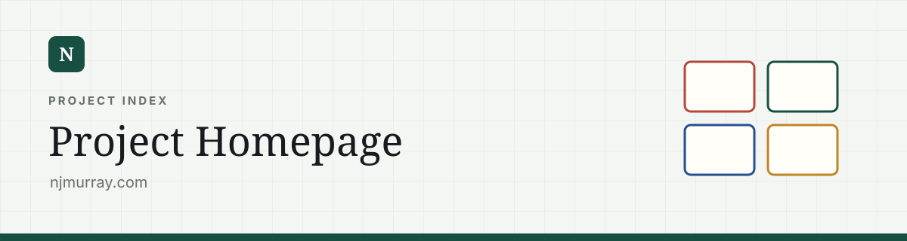

# Project Homepage

Static project index and personal photography gallery at `njmurray.com`. The homepage provides a coherent front door to the separate subdomain applications and the first-party Photography collection.

There is no application state, API request, framework runtime, database, generated content, or server-side rendering. Cloudflare Pages returns `index.html`, and the browser renders that document directly.

## Request and render path

```text
Browser request
→ Cloudflare Pages
→ index.html
→ browser parses HTML and inline CSS
→ analytics script loads independently
→ footer-year script runs
```

A page failure is therefore limited to static delivery or a browser rendering issue. The linked projects can be unavailable without affecting the homepage itself.

## Document structure

Everything visible is in `index.html`:

1. **Metadata and analytics**
   - page title and description;
   - Open Graph title, description, and type;
   - theme colour;
   - Google Analytics loader and configuration.
2. **Inline design system**
   - colour variables;
   - typography;
   - shell, navigation, panels, cards, and responsive rules.
3. **Top navigation**
   - direct canonical links to each project subdomain;
   - external GitHub link opened in a separate tab.
4. **Summary panel**
   - compact shortcuts and high-level site information.
5. **Project sections**
   - music;
   - literature;
   - art;
   - technology.
6. **Footer**
   - static identity link with a year filled by JavaScript.

The project cards are ordinary anchors rather than JavaScript click handlers. Navigation therefore works without client-side JavaScript.

## Photography

`photography/index.html` is an editorial gallery with:

- a responsive hero;
- a natural-ratio masonry collection;
- lazy-loaded 960 px images and 1920 px fullscreen images;
- a keyboard-accessible fullscreen viewer;
- reduced-motion support;
- a dedicated social sharing card.

The screen-sized WebP assets live in `photography/photos/`. This keeps the photographs on the same free Cloudflare Pages deployment as the rest of the site, while the GitHub repository provides a second copy.

To refresh the gallery, place new originals in the source photo folder and run:

```powershell
npm.cmd run photos:sync
```

The sync script accepts another folder as an optional argument:

```powershell
npm.cmd run photos:sync -- "C:\path\to\photos"
```

It rotates from EXIF data, writes responsive WebP copies, and rebuilds `photography/gallery.json`. Optional titles and descriptive alt text belong in `photography/photo-details.json`.

## Layout system

The page uses a centred shell with a maximum width of `1120px`.

The main visual tokens are CSS custom properties:

```css
--paper
--surface
--ink
--muted
--line
--green
--green-dark
--blue
--red
--gold
--shadow
```

The background combines two repeating linear gradients over `--paper`, creating the grid texture without an image asset.

The summary panel uses four equal columns separated by the panel background colour. Project cards use a six-column grid and normally span three columns, producing two cards per row. The Photography feature spans the full width. Each card variant assigns its icon block and top border an accent colour.

Responsive behaviour:

| Breakpoint | Change |
| --- | --- |
| `860px` | Project grid becomes one column; cards become shorter; section headings and footer stack. |
| `560px` | Shell gutters narrow; top navigation wraps below the wordmark; summary panel becomes one column. |

No layout measurement is performed in JavaScript; the browser resolves every breakpoint through CSS.

## Semantics and accessibility

- Navigation uses a labelled `<nav>`.
- Project collections use named sections with heading relationships.
- Decorative SVGs and arrows are hidden from assistive technology.
- Each entire card is a single anchor, producing a large keyboard and pointer target.
- Text and icons remain in the HTML rather than being generated after load.
- Focus and hover behaviour are CSS-driven.

## Runtime JavaScript

Two scripts execute:

1. Google Analytics initialises `dataLayer` and configures measurement ID `G-GDNHTX5GQZ`.
2. The footer script writes the browser’s current year into `#year`.

Neither script controls navigation, layout, or project visibility. If analytics is blocked, the page continues to function normally.

## Source of truth

Project information is deliberately duplicated in a few user-facing structures:

- top navigation;
- summary panel;
- full project cards.

There is no shared data object generating these elements. A project addition, removal, rename, or URL change must be applied consistently to each relevant structure.

Each project card contains:

- a canonical destination URL;
- a category-specific class;
- a decorative SVG;
- a title;
- a short functional description;
- an arrow indicating navigation.

## Response headers

`_headers` contains Cloudflare Pages response-header rules. It is the place for site-wide browser policy or cache directives that should be sent with static responses.

`DEPLOYMENT.md` contains operational hosting notes and is intentionally separate from this technical description of the page.

## File map

| File | Responsibility |
| --- | --- |
| `index.html` | Homepage document, content, inline CSS, analytics, and footer script. |
| `photography/index.html` | Photography page structure and metadata. |
| `photography/photography.css` | Photography layout, gallery and fullscreen viewer styles. |
| `photography/gallery.js` | Gallery rendering and fullscreen interactions. |
| `photography/gallery.json` | Generated photo manifest. |
| `photography/photo-details.json` | Maintained photo titles and alt text. |
| `photography/photos/` | Generated responsive WebP assets. |
| `scripts/sync-photos.mjs` | Repeatable photo optimisation and manifest workflow. |
| `scripts/check-site.mjs` | Static asset and link validation. |
| `_headers` | Cloudflare Pages response headers. |
| `package.json` | Local preview, photo sync and validation commands. |
| `DEPLOYMENT.md` | Hosting and domain reference. |

## Change map

| Change | Main location |
| --- | --- |
| Add or remove a project | Navigation, summary panel, and project section in `index.html` |
| Add photographs | Source photo folder, then `npm.cmd run photos:sync` |
| Change a photograph title or alt text | `photography/photo-details.json`, then run the sync |
| Change a project URL | Every matching anchor in `index.html` |
| Change global colours | `:root` custom properties |
| Change card accent | Card modifier selectors such as `.card--books` |
| Change desktop card layout | `.grid` and card `grid-column` rules |
| Change mobile layout | The `860px` and `560px` media queries |
| Change metadata | `<head>` title, description, Open Graph tags, and theme colour |
| Change analytics | The Google tag block |

## Design constraints

- Project data is manually maintained.
- The common navigation is copied across several independent repositories rather than imported from a shared package.
- Inline CSS keeps the site self-contained but makes `index.html` the single large edit surface.
- No project availability check is performed; every card always renders.
